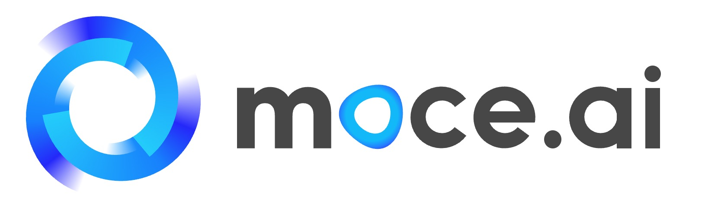
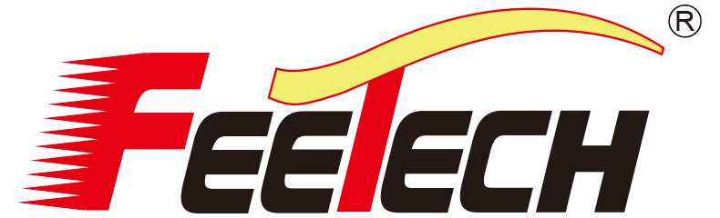
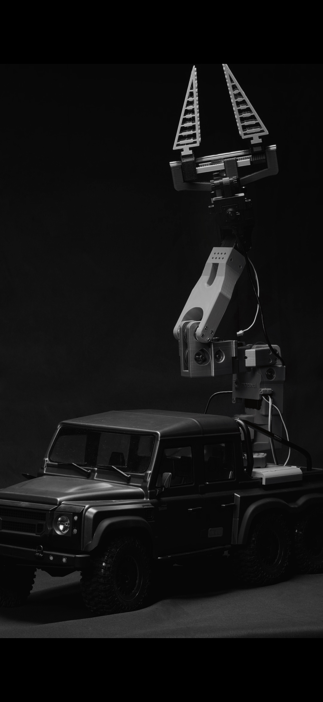

# SOARM-Moce 🤖
> An enhanced robotic arm based on SOARM101: higher payload, larger workspace, and the same control workflow and precision experience  

<p align="center">
  
  <span style="font-size: 24px; margin: 0 15px;">&times;</span>
  
  <br>
  <em>Jointly Developed by MoceAI & Feetech</em>
</p>

> **Open-source plan: March 2026** (code and hardware materials will be released on the open-source date)

[English](README.md) | [中文](README_ZH.md)


<!-- TODO: Replace with your "model overview" image path, e.g. docs/media/overview.jpg -->

---

## 1. Project Overview
**SOARM-Moce** is our enhanced version built on top of **SOARM101**. While keeping the same **5-DOF architecture** and **Python + ROS control workflow**, we reinforce key joints with **metal reduction modules** to significantly improve payload capacity and structural stiffness, while also expanding workspace coverage.

### Development Motivation
We initially set out to create an **affordable, portable robotic arm** for our "mystery robot" project but found no existing products on the market that met our requirements. Therefore, **MoceAI**, with support from servo supplier **Feetech**, collaborated to develop and release this open-source robotic arm.

This project is designed for:
- Makers and open-source hardware developers (rapid secondary development and feature extensions)
- Education and lab teaching (ROS/kinematics/control/vision course support)
- Lightweight applications and prototyping (pick-and-place, interaction demos, etc.)

---

## 2. Appearance and Structure (Image Slots)
### 2.1 Model Overview

<!-- TODO: Model overview image -->

### 2.2 SOARM101 vs SOARM-Moce Comparison

<!-- TODO: Comparison image (recommended: payload/workspace/structural reinforcement points) -->

### 2.3 Core Module Close-up (Metal Reduction Module on Key Joint)

<!-- TODO: Core close-up (recommended labels: key joint, reduction module, mounting position) -->

---

## 3. Key Upgrades (Compared to SOARM101)
- **Major payload boost**: Reinforced key joints with metal reduction modules, resulting in a significant payload increase (validated by experiments).
- **Larger workspace**: Based on public URDF simulation evaluation, workspace area increases by nearly 30%.
- **Higher stiffness and stability**: Reinforced structure provides stronger torsion and deformation resistance, improving overall system stability.
- **Same precision and control habits**: Repeatability remains 1 mm, and control stays Python + ROS, keeping the learning cost low.
- **More complete ecosystem**: Compatible with the upstream **LeRobot** ecosystem and extended with **Moce-specific ecosystem support**.

---

## 4. Core Metrics Comparison (SOARM101 vs SOARM-Moce)
> The following data is summarized from project comparison materials: payload values come from experiments, workspace-related values come from URDF simulation results.

| Metric | SOARM101 | SOARM-Moce | Change |
|---|---:|---:|---:|
| Rated max payload (kg) | 0.3 | 1.5 | **3x** increase |
| Limit payload (kg) | – | 2.0 | Higher payload headroom |
| Repeatability (mm) | 1.0 | 1.0 | Unchanged |
| Max horizontal reach Rmax (mm) | 380.6 | 433.1 | +13.8% |
| Max 3D reach Dmax (mm) | 447.2 | 516.2 | +15.4% |
| Max Z height (mm) | 428.7 | 502.9 | +17.3% |
| XY workspace area (m²) | 0.3255 | 0.4226 | +29.8% |
| Structural material | Standard 3D-printed structure | Reinforced 3D print + metal reduction modules | Higher stiffness |
| Key joint design | Conventional drive structure | Dual-joint metal reduction reinforced design | Torque amplification |
| Degrees of freedom (DOF) | 5 | 5 | Same architecture |
| End-effector support | Generic end-effector interface | Modular custom end-effector interface | Better extensibility |
| Control method | Python + ROS | Python + ROS | Same |
| Ecosystem support | LeRobot | LeRobot compatible + Moce ecosystem | More complete |
| Modular maintenance | Standard structure maintenance | Upgradable/replaceable key joints | Better maintainability |

---

## 5. Repository Contents (To Be Completed After Total Open Source)
> **Note: This repository will be completed on the open-source date in March 2026.**

Expected contents:
- `hardware/`: BOM, structural part list, machining/printing recommendations, assembly instructions
- `urdf/`: URDF files, mesh models, inertia/joint parameters
- `ros/`: ROS packages (launch, control, examples)
- `sdk/`: Python control interface, example scripts, API docs
- `docs/`: Calibration workflow, FAQ, development guide
- `examples/`: Trajectory following, teaching record, grasping demo (optional)

---

## 6. Quick Start
### 6.1 Environment
- Ubuntu 20.04/22.04 is recommended (master/slave serial + camera workflow is mainly Linux-oriented)
- Python 3.10 recommended (SDK minimum: Python 3.8)
- Real-arm mode needs one Leader + one Follower arm and valid serial ports (for example `/dev/ttyACM0`)
- Network ports: `6666/TCP` (control) and `6000/UDP` (camera stream, optional)

### 6.2 Install Dependencies
From repo root:
```bash
python3 -m venv .venv
source .venv/bin/activate
pip install -U pip
pip install -e ./sdk

# Master/Slave runtime
pip install draccus opencv-python PyQt5 lerobot

# Optional (simulation / 3D view)
pip install pybullet vtk
```

### 6.3 Start Leader-Follower Control (Real Hardware)
1. Start slave server on the follower-side device:
```bash
cd Software/Slave
python3 main.py
```
2. Start master client on your PC:
```bash
cd Software/Master
python3 main.py --ip <slave_ip> --port 6666 --leader-port /dev/ttyACM0 --leader-id black_arm_leader
```
3. Built-in CLI commands include:
`savepos`, `goto`, `record`, `play`, `home`, `quit`

Notes:
- If camera target IP or device path is different, update `TARGET_PC_IP` and `CAM1_PATH` in `Software/Slave/main.py`.
- Calibration files are under `Software/Master/calibration/...` and `Software/Slave/calibration/...`.
- Add `--no-cam` on master side if you only need arm control.

### 6.4 Start GUI (Optional)
```bash
cd Software/Master
python3 gui.py
```
Then configure IP/ports in the Settings page and click **Connect**.
If you run into issues, feel free to open an issue.
